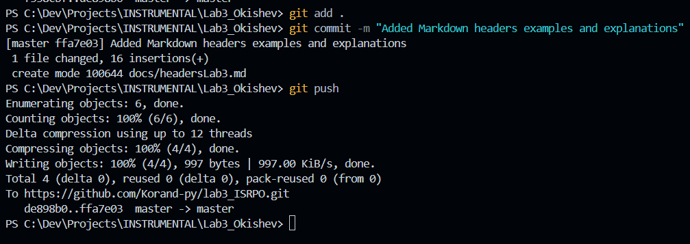
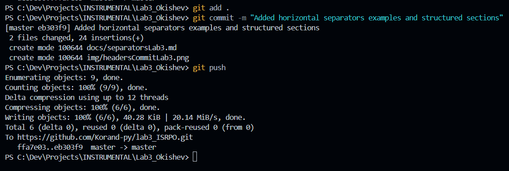
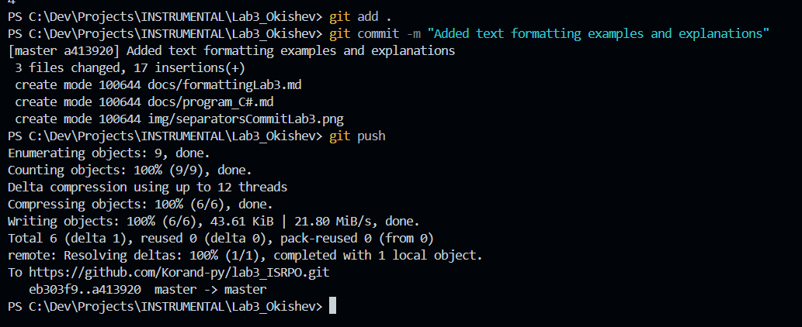
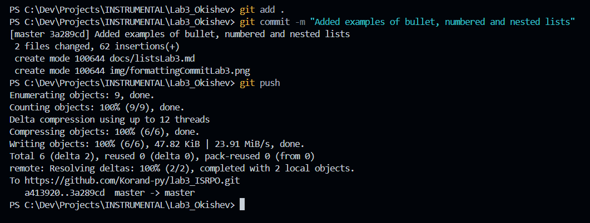
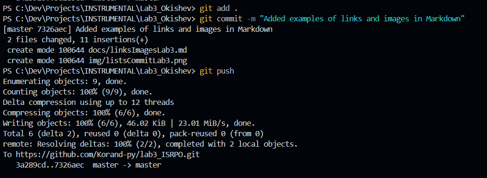
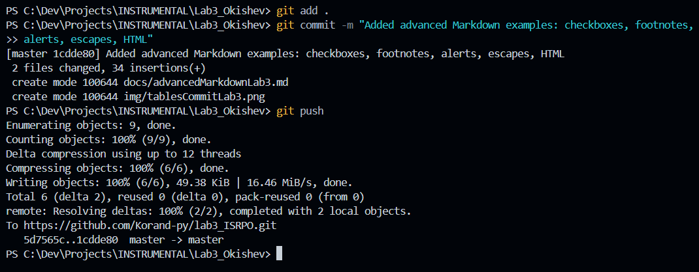
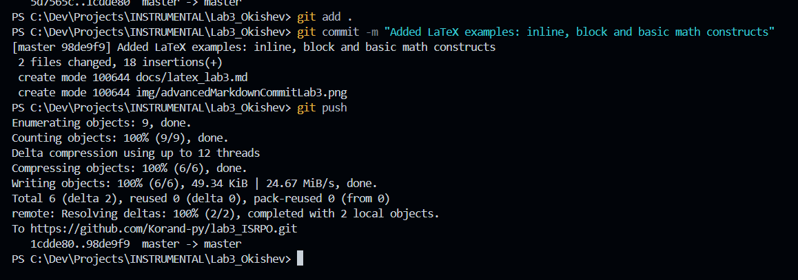
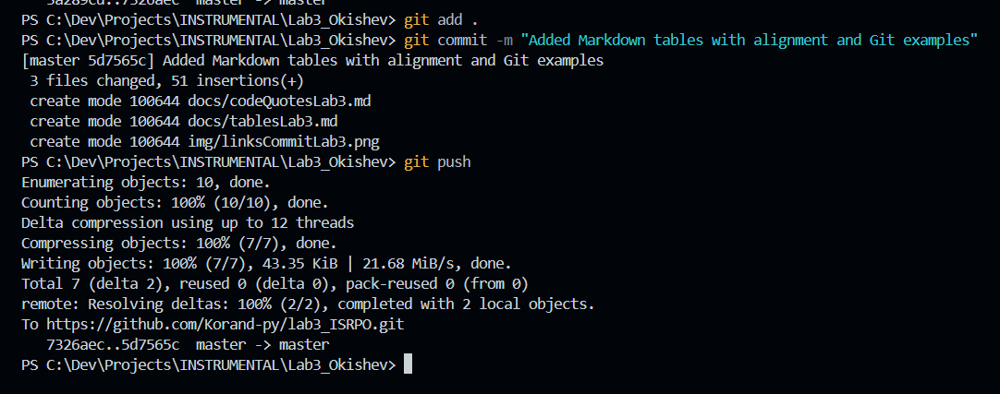
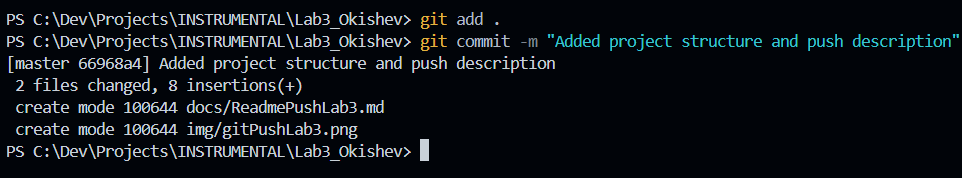
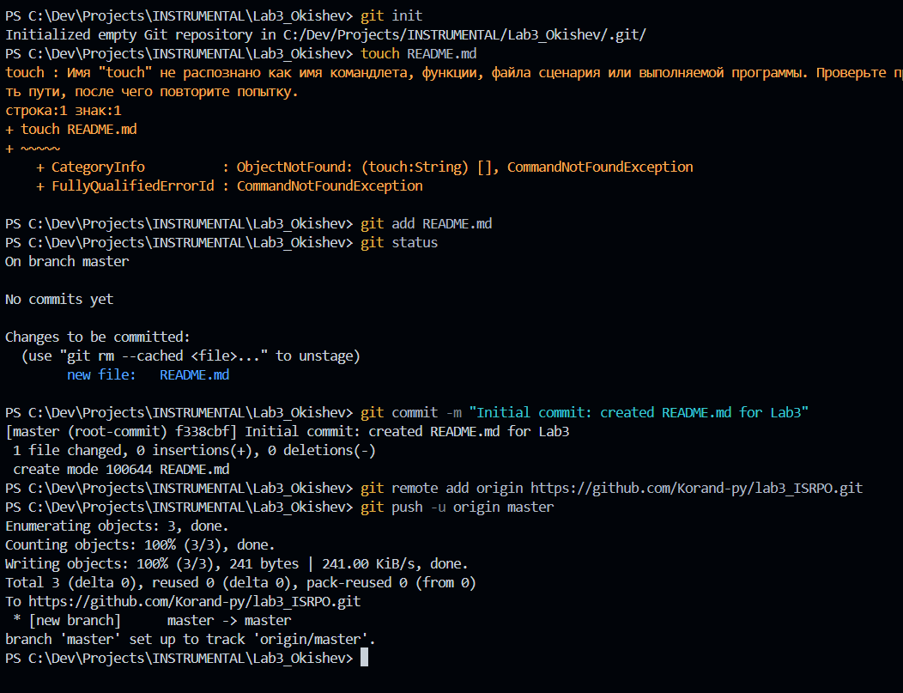

# Лабораторная работа № 3. Markdown-разметка и формулы LaTeX

                           Окишев Максим | ИСП-242

Цель работы — разобраться в синтаксисе Markdown и научиться оформлять документацию проекта: заголовки, списки, таблицы, ссылки, блоки кода и математику.

**Репозиторий:** [Korand-py/lab3_ISRPO](https://github.com/Korand-py/lab3_ISRPO) · **Задания 1–10** 

## Содержание

- [Задание 1. Заголовки](#задание-1-заголовки)
- [Задание 2. Разделители](#задание-2-разделители)
- [Задание 3. Форматирование текста](#задание-3-форматирование-текста)
- [Задание 4. Списки](#задание-4-списки)
- [Задание 5. Ссылки и изображения](#задание-5-ссылки-и-изображения)
- [Задание 6. Таблицы](#задание-6-таблицы)
- [Задание 7. Блоки кода и цитаты](#задание-7-блоки-кода-и-цитаты)
- [Задание 8. Расширенный Markdown](#задание-8-расширенный-markdown)
- [Задание 9. Скриншоты коммитов](#задание-9-скриншоты-коммитов)
- [Задание 10. Формулы LaTeX](#задание-10-формулы-latex)
- [Структура проекта](#структура-проекта)
- [История коммитов](#история-коммитов)
- [Полезные ссылки](#полезные-ссылки)

---

## Задание 1. Заголовки

Уровней на самом деле шесть — от `#` до `######`, но в отчёте хватило трёх, остальные визуально сливаются с H3 и портят структуру:

```markdown
# Заголовок первого уровня
## Заголовок второго уровня
### Заголовок третьего уровня
```



> Количество `#` не обязано совпадать с уровнем заголовка — можно написать `### H1`, GitHub всё равно покажет это как H3. Но так делать не надо: это сбивает генерацию якорь-ссылок, и `#содержание` в этом файле перестаёт работать.

## Задание 2. Разделители

Три варианта, на выходе одна и та же линия:

```markdown
---
***
___
```

Скрин:



## Задание 3. Форматирование текста

### Виды форматирования

Четыре приёма, которые использовал дальше по всей работе:

- **полужирный** — `**важное**`, для названий и терминов
- *курсив* — `*побочное замечание*`, для комментариев на полях
- ~~зачёркнутый~~ — `~~устаревшее~~`, чтобы показать, от чего отказался
- `моноширинный` — обратные апострофы, для команд, файлов и имён функций


### Пример из задания

Комментированная программа из `docs/program_C#.md`:

```csharp
// Запрашиваем два числа
double n1 = Convert.ToDouble(Console.ReadLine());
double n2 = Convert.ToDouble(Console.ReadLine());

// Складываем
double sum = n1 + n2;

// Выводим результат в "форматированном" виде
Console.WriteLine($"**Результаты операций: {sum}**");
```



## Задание 4. Списки

Три вида, которые по условию надо было показать. Маркированный — `-` или `*`, нумерованный — цифры с точкой, вложенный — просто сдвиг на четыре пробела:

- маркированный
  - второй уровень
    - третий уровень
- и опять маркированный, чтобы было видно разницу с нумерованным

1. **Изучить систему контроля версий**
   * Базовые команды `git init`, `git add`, `git status`
   * Работа с ветками
   * ~~Устаревший подход~~ **Современный workflow**
2. **Освоить разметку документации**
   * Заголовки и разделители
   * Форматирование текста
   * Таблицы и списки
3. **Настроить удалённый репозиторий**
   * `git remote add origin <url>`
   * `git push -u origin master`



## Задание 5. Ссылки и изображения

Внешняя ссылка — в скобках адрес, в квадратных то, что увидит читатель. В кавычках можно добавить подсказку, она появится при наведении:

[Markdown Guide](https://www.markdownguide.org/ "здесь все конструкции с примерами")

Внутренняя ссылка ведёт на якорь внутри этого же файла. Имя заголовка пишется в нижнем регистре, пробелы заменяются на дефисы, знаки препинания отбрасываются: [назад к содержанию](#содержание), [к структуре проекта](#структура-проекта).

Изображение — тот же синтаксис, только с восклицательным знаком в начале:

```markdown

```








Путь к картинке пишу относительным (`./img/...`), а не абсолютным — тогда README нормально открывается и в клоне на другом компьютере.

## Задание 6. Таблицы

Таблица состоит из «трубы» и строки-разделителя, а разделитель уже задаёт выравнивание:

```markdown
| Возможность | Разметка | Где применяется |
| :---: | :---: | :---: |
| Заголовки | `#` | Разделы отчёта |
```

### Синтаксис и выравнивание

`:---` — по левому краю, `:---:` — по центру, `---:` — по правому.

### Сводка по работе

Сводка по тому, что использовал:

| Возможность | Разметка | Где применяется |
| :---: | :---: | :---: |
| Заголовки | `#`, `##`, `###` | Разделы этого README |
| Разделители | `---` | Перед блоком «Структура проекта» |
| Форматирование | `**`, `*`, `~~`, моноширинный | Акценты в тексте |
| Списки | `-`, `1.`, вложенность | План работы и чек-листы |
| Таблицы | `\|` + разделитель | Эта и таблица с коммитами |
| Ссылки и картинки | `[текст](url)`, `` | Содержание, скриншоты |
| Формулы | `$...$`, `$$...$$` | Задание 10 |



## Задание 7. Блоки кода и цитаты

Инлайн-код — обратные апострофы: команда `git status`, файл `FormatDemo.cs`, ветка `master`.

Блочный код — тройные апострофы, после них обязательно указывается язык, иначе GitHub не будет подсвечивать синтаксис:

```csharp
// с подсветкой
```

```bash
git add README.md
git commit -m "Added README"
git push -u origin master
```

Без указания языка подсветки не будет, код выведется серым моноширинником:

```
git commit //без указания языка
```

Цитаты — знак `>` в начале строки. Вложенность добавляется повторными знаками:

> Обычная цитата.
>
> > Второй уровень.
> >
> > > Третий — так обычно оформляют переписку.

## Задание 8. Расширенный Markdown

Чекбоксы. Отметку ставит `[x]` внутри обычного маркированного списка — GitHub сам нарисует галочку и зачёркнет выполненный пункт:

- [x] Заголовки и разделители
- [x] Форматирование текста
- [x] Списки
- [x] Ссылки и изображения
- [x] Таблицы
- [x] Блоки кода и цитаты
- [x] Сноски и alert-блоки
- [ ] ~~Добавить формулы~~ Написать их в самом конце, отдельным коммитом *(дописал)*

Сноска — ссылка в тексте на примечание внизу страницы:

Оформление отчётов через Markdown экономит кучу времени на копировании структуры[^note].

[^note]: Полное описание синтаксиса лежит в `docs/advancedMarkdownLab3.md`, а вёрстку я проверял прямо на GitHub — так видно, что именно движок рендерит, а что остаётся сырым текстом.

Alert-блоки — это обычные цитаты, которым в первой строке меняют подпись на `[!NOTE]`, `[!TIP]` или `[!WARNING]`:

> [!NOTE]
> Практически всё, что есть в этом файле, работает на GitHub без сторонних плагинов и расширений.

> [!TIP]
> Внутреннюю ссылку удобно проверять так: кликнуть по пункту в оглавлении и посмотреть, что оказалось в адресной строке. GitHub сам подставляет кириллицу в якорь, нужно только не забыть заменить пробелы на дефисы.

> [!WARNING]
> Если поставить `---` сразу после строки текста, без пустой строки между ними, GitHub посчитает это не разделителем, а заголовком второго уровня. У меня так случайно превратился один раздел в H2 — пришлось переделывать.

## Задание 9. Скриншоты коммитов

По условию к каждому коммиту прикладывается скриншот из интерфейса GitHub. Из-за того, что скриншот нельзя сделать из того же коммита, который он иллюстрирует, я сначала коммитил саму разметку, а скриншот добавлял следующим — поэтому имена файлов в `img/` немного «сдвинуты» относительно заданий.

Общая структура коммита:



Отправка на GitHub:



## Задание 10. Формулы LaTeX

### Инлайн-формула

Инлайн-формула пишется между двумя долларами и встаёт прямо в строку: $E = mc^2$, площадь круга $S = \pi r^2$.

### Блочная формула

Блочная — между `$$`, каждая на своей строке:

$$
\sum_{i=1}^n i = \frac{n(n+1)}{2}
$$

Интеграл посложнее, из задания:

$$
\int_{a}^{b} \sqrt{\frac{x + \alpha}{y^n}} \, dx
$$

### Основные конструкции

| Конструкция | Запись | Результат |
| :---: | :---: | :---: |
| Дробь | `\frac{a}{b}` | $\frac{a}{b}$ |
| Корень | `\sqrt{x}` | $\sqrt{x}$ |
| Греческая буква | `\alpha` | $\alpha$ |
| Степень | `x^2` | $x^2$ |
| Индекс | `\int_a^b` | $\int_a^b$ |
| Сумма | `\sum` | $\sum$ |

## Структура проекта

### Дерево файлов

```text
Lab3_Okishev/
├── README.md                    # этот отчёт
├── docs/                        # примеры разметки, по файлу на задание
│   ├── headersLab3.md           # задание 1
│   ├── separatorsLab3.md        # задание 2
│   ├── formattingLab3.md        # задание 3
│   ├── program_C#.md            # ТЗ на FormatDemo.cs
│   ├── listsLab3.md             # задание 4
│   ├── linksImagesLab3.md       # задание 5
│   ├── tablesLab3.md            # задание 6
│   ├── codeQuotesLab3.md        # задание 7
│   ├── advancedMarkdownLab3.md  # задание 8
│   ├── latex_lab3.md            # задание 10
│   └── ReadmePushLab3.md        # команды пуша
├── img/                         # скриншоты коммитов (10 шт.)
│   ├── gitPushLab3.png
│   ├── commitStructureLab3.png
│   ├── headersCommitLab3.png
│   └── ...по одному на коммит
└── latex/                       # папка под выгрузку .tex, пока пустая
```

### Описание папок

Коротко по папкам:

- **docs/** — все примеры, каждый файл соответствует отдельному заданию
  - `headersLab3.md`, `separatorsLab3.md` — структура документа
  - `formattingLab3.md`, `listsLab3.md` — текст, планы, списки
  - `linksImagesLab3.md`, `tablesLab3.md` — ссылки, картинки, таблицы
  - `codeQuotesLab3.md`, `advancedMarkdownLab3.md` — код, цитаты, чекбоксы, сноски
  - `latex_lab3.md` — формулы
- **img/** — скриншоты, всё в корне без вложенностей, чтобы путь в разметке был коротким
- **latex/** — создал под выгрузку формул отдельно от Markdown, но в итоге не пригодилось, всё осталось в `.md`

## История коммитов

| Коммит | Сообщение | Что внутри |
| :---: | :--- | :--- |
| `f338cbf` | Initial commit: created README.md for Lab3 | пустой README |
| `66968a4` | Added project structure and push description | `docs/ReadmePushLab3.md`, скрин пуша |
| `de898b0` | Added commit image | скрин структуры коммита |
| `ffa7e03` | Added Markdown headers examples and explanations | `docs/headersLab3.md` |
| `eb303f9` | Added horizontal separators examples | `docs/separatorsLab3.md`, скрин |
| `a413920` | Added text formatting examples | `docs/formattingLab3.md`, `docs/program_C#.md` |
| `3a289cd` | Added examples of bullet, numbered and nested lists | `docs/listsLab3.md`, скрин |
| `7326aec` | Added examples of links and images | `docs/linksImagesLab3.md`, скрин |
| `5d7565c` | Added Markdown tables with alignment and Git examples | `docs/tablesLab3.md`, `docs/codeQuotesLab3.md` |
| `1cdde80` | Added advanced Markdown examples | `docs/advancedMarkdownLab3.md`, скрин |
| `98de9f9` | Added LaTeX examples | `docs/latex_lab3.md`, скрин |
| `9c10eaf` | Delete README2 | удалил пустой README |


## Полезные ссылки

- [Markdown Guide](https://www.markdownguide.org/) — синтаксис с примерами
- [GitHub Docs: Writing and formatting syntax](https://docs.github.com/ru/get-started/writing-on-github/getting-started-with-writing-and-formatting-on-github/basic-writing-and-formatting-syntax) — что именно понимает GitHub, включая alert-блоки и сноски
- [CommonMark 0.31.2](https://spec.commonmark.org/0.31.2/) — формальная спецификация, там же таблица поддерживаемых конструкций
- [Obsidian](https://obsidian.md/) — редактор, в котором собран этот README, и [его документация](https://help.obsidian.md/) по плагинам для таблиц и формул
